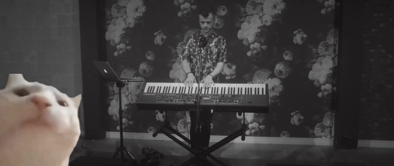
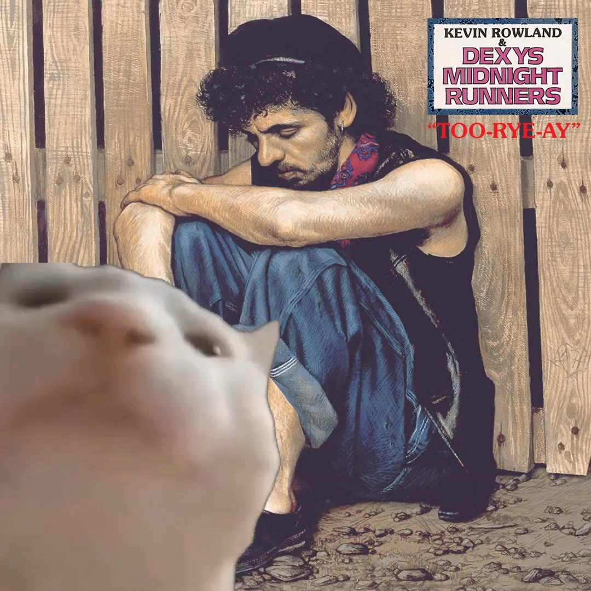

# Vibing Cat Synchroniser

Composites and synchronises the vibing cat (or other video) to music!

Examples (click to view):

[](https://edd.salkield.uk/static/vibing_cat/never_count_on_cat.mp4)

[](https://edd.salkield.uk/static/vibing_cat/come_on_eileen.mp4)

## Installation

This project depends upon [ffmpeg](https://ffmpeg.org/download.html), so install that first.

Clone the repo, and run `poetry install` to install the python dependencies into a venv.

A python package is not currently available, although I might make one in the future if prompted.

## Basic Usage

`vibing-cat` outputs an ffmpeg render script which, when run, composites the final video video.

`poetry run vibing-cat ./path/to/audio ./path/to/video ./path/to/output/video`

The render script is output to the default location of `./render.sh`

Additional options are available.  Some common ones include:

`--show-plots` - generate beat matching plots
`--beat-threshold FLOAT` - change how certain the algorithm has to be to consider a given sample a beat.  Increase this value if insufficient beats are found, and vice versa.
`--output-render-script PATH` - choose a different render script location

Videos other than the vibing cat can be used as an overlay, see [Custom Overlays](#custom-overlays)

## Description

Beat analysis performed as per the method described in [ENHANCED BEAT TRACKING WITH CONTEXT-AWARE NEURAL NETWORKS](http://www.cp.jku.at/research/papers/Boeck_Schedl_DAFx_2011.pdf), using the [madmom](https://github.com/CPJKU/madmom) library.

Firstly, on/off beats are counted, resulting in a list of "time since last beat".  Outliers are then determined according to the number of standard deviations from the median specified by the long and short outlier cutoffs.

Short outliers are discarded (since they probably represent invalid beats).  Long outliers are naïvely assumed to correspond to beat breaks, where the beat disappears for a bit and then returns later on.

For each long outlier, we forward fill beats by taking an average of the beat lengths before and after the break, and scaling to fit.  In the future, this scaling might be done linearly instead of an average.

The end result is a list of "time since last beat" with forward-filled breaks.

Finally, we parse this into a long ffmpeg command to synchronise the cat to the music, apply an additional compositing step, and output the script.  When run, the rendering script actually produces the final video.

## Full Usage

```bash
Usage: vibing-cat [OPTIONS] AUDIO_FILE VIDEO_FILE OUTPUT_VIDEO_FILE

  Ouputs a render script in output_render_script to generated a composited,
  beat-matched vibing cat.

Arguments:
  AUDIO_FILE         The audio file to beatmatch to  [required]
  VIDEO_FILE         The video file to composite on top of  [required]
  OUTPUT_VIDEO_FILE  Where to output the resulting video file  [required]

Options:
  --show-plots / --no-show-plots  Whether to generate beat matching plots
                                  [default: False]

  --output-render-script PATH     Path to output the render script to
                                  [default: render.sh]

  --overlay-video-file PATH       Path to the overlay video file  [default:
                                  cat.mp4]

  --intermediate-output-file PATH
                                  Path to use as the intermediate file for the
                                  compositing step  [default:
                                  intermediate.mp4]

  --offset FLOAT                  Add a constant offset to the video
                                  [default: 0]

  --beat-threshold FLOAT          The minimum certainty for a beat to be
                                  considered, between 0 and 1.  Increase this
                                  value if insufficient beats are found, and
                                  vice versa.  [default: 0.5]

  --short-outlier-cutoff FLOAT    Number of standard deviations from the
                                  median that a beat is required to be
                                  considered a short pause  [default: 0.25]

  --long-outlier-cutoff FLOAT     Number of standard deviations from the
                                  median that a beat is required to be
                                  considered a long pause  [default: 0.25]

  --beats-per-second FLOAT        The number of beats per second in
                                  overlay_video_file  [default: 2]

  --frames-per-beat INTEGER       The number of frames per beat in
                                  overlay_video_file  [default: 15]

  --n-beats INTEGER               The number of beats present in
                                  overlay_video_file  [default: 20]

  --colorkey TEXT                 The colorkey filter argument to be supplied
                                  to ffmpeg for compositing  [default:
                                  0x2bd51b:0.15:0.15]

  --install-completion [bash|zsh|fish|powershell|pwsh]
                                  Install completion for the specified shell.
  --show-completion [bash|zsh|fish|powershell|pwsh]
                                  Show completion for the specified shell, to
                                  copy it or customize the installation.

  --help                          Show this message and exit.
```

## Custom Overlays

This program can be used to beatmatch videos other than the vibing cat!

First ensure that you have a perfect loop of the overlay video, and edit it to a known bpm.  I chose 120bpm for the cat.  Then, based upon the framerate, calculate and supply the program with the following flags:

`--beats-per-second FLOAT`
`--frames-per-beat INTEGER`
`--n-beats INTEGER`

Then adjust the `--colorkey TEXT` flag as appropriate to perform compositing correctly.
